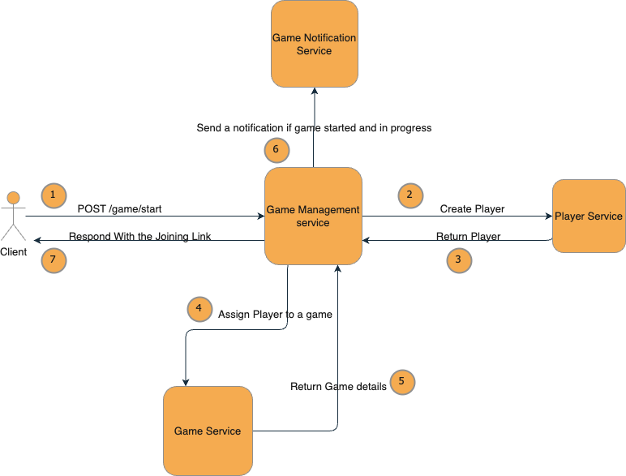
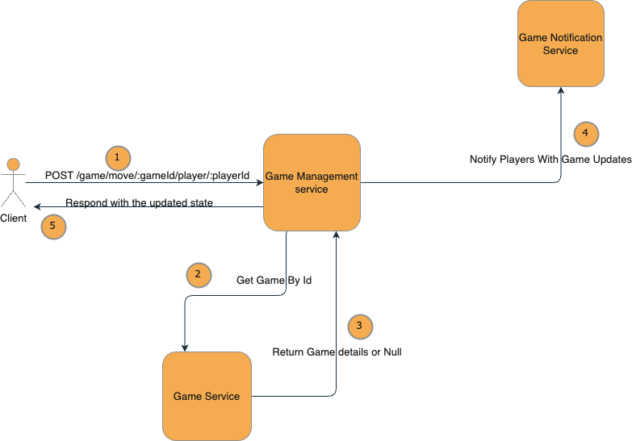

# Game Of Three

Game of Three is a simple task for JET

## Requirements
- npm
- node >= 14
## Installation

Use the package manager [npm](https://npmjs.com) to install game of three.

```sh
npm install && npm start
```

## Usage
- When you start the server, it will run on the default port which is 3000. 
- The Game Management service is responsible for orchestration and handles communication between the client and other services. 
- The Game Use server sends Server-Sent Events (SSE) in order to push notifications.


## REST APIs

### Start Game
An API to start game or join available one.

`Post /game/start` 
#### Request
```json
{
    "email": "abdo@gmail.com"
}
```

#### Response
```json
{
    "state": {
        "playerId": "dce64b06-cf99-41c8-8fe8-9a03f72bd437",
        "gameId": "6b91445a-f71b-4023-82eb-98379378e80d",
        "number": 40,
        "gameStatus": "PENDING",
        "isTurn": true
    },
    "joinLink": "http://localhost:3000/subscribe/6b91445a-f71b-4023-82eb-98379378e80d/player/dce64b06-cf99-41c8-8fe8-9a03f72bd437"
}
```

#### How it Works



    1. Call Player service to create or return user.
    2. Call Game service to assign user to available or new game.
    3. Check if game should start and notify players through notification service.
    4. Return game state.

### Make Move
Make your move.

`Post /game/move/:gameId/player/:playerId`
#### Request
```json
{
    "number": 1 // one of these 3 numbers [-1, 0, 1]
}
```

#### Response
```json
{
    "playerId": "9af243e6-0fbe-406c-95c6-61201d18e91f",
    "gameId": "35ceb352-a371-454d-8c2f-3df92093fcfe",
    "number": 5,
    "gameStatus": "IN_PROGRESS",
    "isTurn": false
}
```

#### How it Works




    1. Call the Game service to retrieve the game.
    
    2. verify the game availability.

    3. verify user's turn to play.

    4. Perform the necessary calculations.

    5. Check game state
        - If the game is finished, notify all players that the game is over.

        - If the game is still in progress, notify the next player turn.

## Testing

Run unit tests using:
```sh
npm run test
```

Use the simple client I created to test the game with two terminals..
```sh
npm run client
```